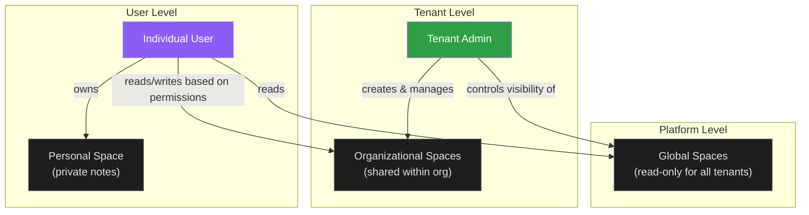
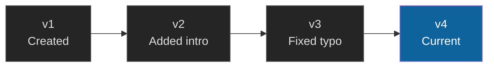
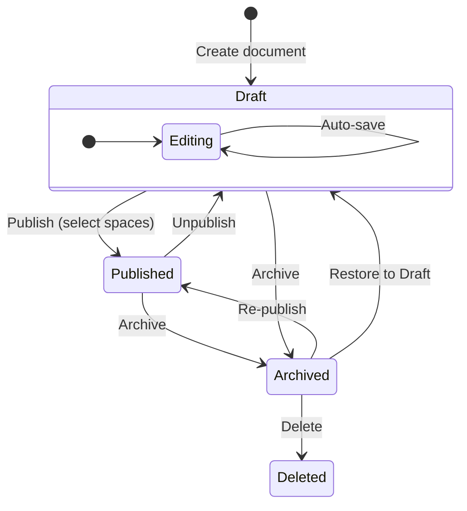
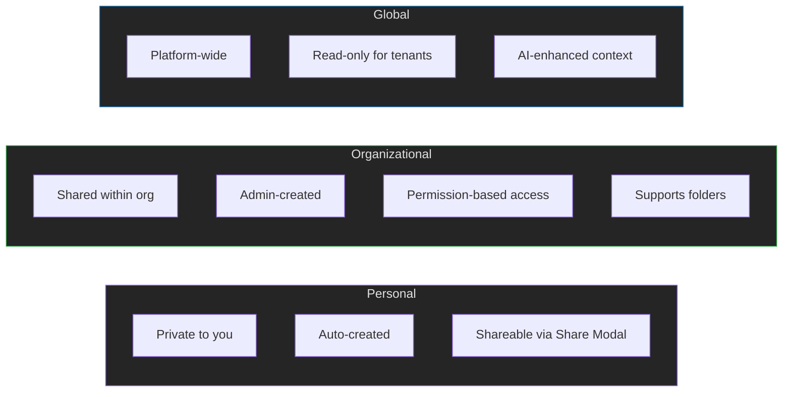

# Documents

The Documents feature is a shared, versioned knowledge base built into Belfalas. It lets individuals write personal notes, teams collaborate on organizational documentation, and platform administrators publish read-only guides that every tenant can access.

---

## Overview

Documents live inside **spaces** — containers that control who can see and edit the content within them. Spaces can contain **folders** for organizing documents into a hierarchy. There are three types of spaces, each serving a different audience:

| Space Type | Who Creates It | Who Can Edit | Who Can Read | Icon |
|---|---|---|---|---|
| **Personal** | Created automatically for each user | Owner only | Owner only | 🔒 |
| **Organizational** | Tenant admin | Users with write/admin permission | Users with read permission (or everyone if published) | 📂 |
| **External (Confluence)** | Tenant admin (via Connect) | Users with permission (edits sync to Confluence) | Users with read permission | 🔗 |
| **Global** | Platform admin (platform-wide) | Platform admin only | All tenants (read-only) | 🌐 |



---

## Getting Started

### Accessing the Document Hub

Navigate to **Documents** in the top navigation bar. This opens the Document Hub — your central view for browsing, searching, and creating documents.

**Hub layout:**

- **Sidebar (left)** — Lists all spaces you have access to, grouped by type (My Space, Shared with Me, Organizational Spaces, Global Documentation), with document counts
- **Content area (right)** — Shows recent documents, search results, shared documents, or documents in the selected space; folders appear at the top of the list when browsing a space
- **Toolbar (top)** — Search bar and "New Document" button

### Creating Your First Document

1. Click **+ New Document** in the toolbar
2. Enter a **title** for your document
3. Click **Create**

Your new document is created in your **Personal space** as a draft. You'll be taken directly to the document editor where you can start writing. When you're ready to share it, you can **publish** it to one or more organizational spaces (see [Publishing to Spaces](#publishing-to-spaces) below).

---

## Spaces in Detail

### Personal Space

Every user automatically receives a personal space the first time they access the Documents feature. This space:

- Is **private** — only you can see its contents
- Cannot be deleted or renamed
- Is marked with a 🔒 lock icon in the sidebar
- Is ideal for drafts, personal notes, and scratch documents

### Organizational Spaces

Organizational spaces are shared containers managed by the tenant admin. They appear under the **Organizational Spaces** section in the sidebar.

Tenant admins create organizational spaces to suit their team's needs — for example, "Engineering Docs", "Onboarding", or "Team Handbook". There are no default organizational spaces; admins create them on demand.

**Visibility settings** control the default access level:

| Visibility | Behavior |
|---|---|
| Workspace | Visible only to users who have been explicitly granted access |
| Published | Read-only to all organization members (no assignment needed) |
| Private | Hidden from everyone except users with explicit permission |

**Permissions** are assigned at the user or group level:

| Permission Level | What It Allows |
|---|---|
| Read | View documents in the space |
| Write | Create, edit, and update documents |
| Admin | Full control — edit space settings, manage permissions, delete documents |

> **Tip:** Use groups to manage access at scale. Instead of assigning permissions to each user individually, create a group (e.g., "Engineering") in User Management, then grant that group access to relevant spaces.

### External Spaces (Confluence)

External spaces connect Belfalas to your organization's **Confluence** instance. They appear under **External Spaces** in the Document Hub sidebar with a 🔗 link icon. Two sync modes are available:

| Mode | How It Works | Best For |
|---|---|---|
| **Proxy** | Documents are fetched live from Confluence on every access — nothing is stored locally | Real-time accuracy, zero data duplication |
| **Cached** | Documents are synced and stored locally as Markdown copies | Fast access, offline browsing, full-text search |

A small badge next to the space name indicates the mode: **proxy** (yellow) or **cached** (green).

> For details on connecting Confluence, managing permissions, and working with external documents, see the **Confluence Integration** guide.

### Global Spaces

Global spaces contain platform-wide documentation that is shared across **all tenants** in read-only mode. They appear under **Global Documentation** in the Document Hub sidebar. Tenants cannot edit global documents — they are reference material provided by the platform.

**Space kinds** categorize global spaces:

| Kind | Purpose | Example Content |
|---|---|---|
| Platform | Page-matched docs surfaced by the AI agent | Feature guides, how-tos, tooltips |
| Engineering | Architecture and pattern documentation | System design docs, coding standards |
| Reference | Specifications and standards | Data dictionaries, style guides |
| Custom | General-purpose documentation | Release notes, FAQs, onboarding guides |

Your platform admin can also create additional custom space kinds beyond these defaults.

> **Note:** Some global documents are associated with specific application pages. When you're on a particular page, the AI assistant automatically has access to the relevant docs for that page — no manual searching required.

Your tenant admin can control which global spaces are visible to your organization and optionally restrict specific global spaces to certain groups.

---

## Folders

Spaces can contain **folders** to organize documents into a hierarchy. Folders can be nested inside other folders, letting you build a tree structure that mirrors your team's information architecture.

### Browsing Folders

When you select a space in the sidebar, any folders in that space appear at the top of the document list. Click a folder to drill into it and see its contents (documents and sub-folders). A breadcrumb trail at the top shows your current path.

### Creating Folders

1. Navigate to the space or parent folder where you want to create a folder
2. Click **New Folder**
3. Enter a name
4. Click **Create**

> **Note:** In organizational spaces, you need **admin** permission on the space to create, rename, move, or delete folders.

### Moving Documents Into Folders

1. Open the document in the editor
2. Use the **Move to Folder** option to select a target folder within the document's current space
3. To move a document back to the space root, select "No Folder" (root)

Documents can only be moved to folders within their own space — you cannot move a document to a folder in a different space.

### Renaming and Deleting Folders

- **Rename:** Click the folder options menu and select **Rename**
- **Delete:** Click the folder options menu and select **Delete**. When a folder is deleted, any documents inside it are moved to the space root — they are not deleted.

### Nested Folders

Folders can be nested to create a multi-level hierarchy. When you create or move a folder, you can select a parent folder to nest it under. There is no hard limit on nesting depth, but keeping hierarchies shallow (3–4 levels) is recommended for ease of navigation.

---

## The Document Editor

Click any document card in the Hub to open the editor. The editor is a **Markdown editor** with live preview and auto-save.

### Editor Layout

```
┌──────────────────────────────────────────────────────────┐
│  [Title]  [Status Badge]  [👤👤👤 2 collaborators]        │
│                           [Publish] [Share] [⏱]          │
├───────────────────────────────┬───────────────────────────┤
│                               │                           │
│   Markdown Editor (left)      │   Live Preview (right)    │
│                               │                           │
│   Write your content here     │   Rendered output here    │
│   using standard Markdown     │   updates in real-time    │
│                               │                           │
├───────────────────────────────┴───────────────────────────┤
│  Space: Engineering Docs  ·  Version 3  ·  ✓ Saved        │
└──────────────────────────────────────────────────────────┘
```

### View Modes

Toggle between three view modes using the mode buttons in the toolbar:

| Mode | Description |
|---|---|
| **Edit** | Full-width text editor only |
| **Split** (default) | Side-by-side editor and rendered preview |
| **Preview** | Full-width rendered preview only |

### Writing in Markdown

The editor uses standard Markdown with support for:

- **Headings** (`# H1`, `## H2`, `### H3`, etc.)
- **Bold** (`**text**`), **italic** (`*text*`), **strikethrough** (`~~text~~`)
- **Links** (`[label](url)`) and **images** (``)
- **Code blocks** with syntax highlighting (` ```language ... ``` `)
- **Tables** (pipe-delimited)
- **Blockquotes** (`> text`)
- **Ordered and unordered lists**
- **Task lists** (`- [ ] todo`, `- [x] done`)
- **Mermaid diagrams** (` ```mermaid ... ``` `) — flowcharts, sequence diagrams, ER diagrams, etc.

### Uploading Images

You can upload images directly into a document instead of linking to an external URL:

1. Click the **Upload Image** button in the editor toolbar (or drag and drop an image into the editor)
2. Select an image file from your computer
3. The image is uploaded and a Markdown image reference is inserted at your cursor position

**Supported formats:** PNG, JPEG, GIF, WebP, SVG
**Maximum file size:** 5 MB per image

Uploaded images are stored alongside the document and are accessible to anyone who can view the document, including via public share links. You can view all uploaded images for a document and delete any you no longer need.

### Pinning Documents

You can **pin** important documents so they always appear at the top of the document list in their space. Pinned documents sort above all other documents regardless of the selected sort order.

To pin or unpin a document, use the pin toggle in the document editor toolbar or from the document's options menu in the Hub.

### Tags

Add **tags** to your documents to categorize and organize them. Tags appear on document cards in the Hub and can be used to filter documents.

- In the editor, add tags using the tags field
- You can add up to **50 tags** per document
- Tags help you and your team discover related content quickly

### AI Agent Access

Each document has an **AI Agent Access** toggle that controls whether the AI assistant can reference the document when answering questions. This is enabled by default. Disable it for sensitive drafts or documents you don't want the AI to surface.

For Confluence spaces, agent access is also controlled at the **space level** by the tenant admin. Both the space-level and document-level toggles must be enabled for the AI to access a document.

### Auto-Save

The editor automatically saves your work:

- Changes are saved **shortly after you stop typing**
- The save indicator in the footer shows the current state:
  - **✓ Saved** (green) — All changes saved
  - **⟳ Saving...** — Save in progress
  - **● Unsaved changes** (yellow) — Changes pending save
  - **✗ Save failed** (red) — Save attempt failed (will retry)
- If you navigate away, a final save is triggered automatically

> **Important:** Auto-save updates your document in place but does **not** create a new version snapshot. To create a version snapshot you can restore later, see [Creating a Version Snapshot](#creating-a-version-snapshot) below.

---

## Version History

Documents support explicit **version snapshots** that let you save named checkpoints and restore previous content.

### Creating a Version Snapshot

To create a version snapshot you can return to later:

1. Click the **Save Version** button (or use the version controls in the toolbar)
2. Optionally add a **change summary** describing what changed (e.g., "Added troubleshooting section")
3. The snapshot is saved with a version number (v1, v2, v3, etc.)

Version snapshots capture the full content of the document at that moment in time. You can browse, compare, and restore any saved snapshot.

### Browsing Versions

Click the **History** button (⏱) in the editor toolbar to open the version history sidebar. This shows a chronological list of all version snapshots (newest first).

Each version entry displays:

- **Version number** (e.g., v1, v2, v3)
- **Who** made the change (user name or "System" for automated changes)
- **When** the snapshot was created
- **Change summary** (if one was provided)
- A **Published** badge if that version is the currently published snapshot
- A **Kept** badge if the version has been pinned (see below)

### Version Detail

Click any version in the history sidebar to open a **version detail modal**. This shows:

- Version number and creation date
- Author name and author type (user vs. system)
- Change summary (if provided)
- Word count at that version
- The full content of the document at that version
- Which spaces the version is published to (if any)

### Keeping (Pinning) Versions

You can **keep** important versions to protect them from automatic cleanup. A kept version will never be removed when the version limit is reached.

- In the version history sidebar, click the **Keep** button next to a version to pin it
- Kept versions display a 📌 **Kept** badge
- Click **Unkeep** to remove the pin and allow the version to be auto-evicted again

This is useful for preserving milestone snapshots — for example, the content at the time of a release or a major rewrite.

> **Tip:** If all your version slots are occupied by kept or published versions, you'll be prompted to choose which older version to replace when creating a new snapshot.

### Version Limits

Your admin configures the **maximum number of versions** kept per document (default: 10). When a new version is created and the limit is reached, the oldest non-published, non-kept version is automatically removed. Published and kept versions are always protected from automatic deletion.



---

## Document Lifecycle

Every document follows a status workflow from creation through publishing, archiving, and optionally back again.



### Statuses

| Status | Badge Color | Meaning |
|---|---|---|
| **Draft** | 🟡 Yellow | Work in progress — only visible to the author and users with write/admin access to the space |
| **Published** | 🟢 Green | Finalized and visible to all users with read access to the target space(s) |
| **Archived** | ⚪ Grey | No longer active — preserved for historical reference, removed from published spaces |

### Publishing to Spaces

A document can be published to **one or more** organizational spaces simultaneously. Publishing makes a document visible in the target spaces without moving it from its home space.

- **Publish:** Click the **Publish** button in the editor toolbar. A modal opens where you select which organizational space(s) to publish the document into. You can also choose a specific **folder** within each space as the publication target. A snapshot of the current version is recorded.
- **Publish a specific version:** When publishing, you can optionally select a specific version snapshot to publish instead of the latest content.
- **Multi-space publishing:** A single document can appear in multiple spaces at once. Each publication tracks which version was published.
- **Republish:** After editing a published document, click **Republish** to update all published spaces with the latest version.
- **Unpublish from a space:** You can remove the document from individual spaces without affecting other publications.
- **Unpublish all:** Removes the document from all published spaces and returns it to draft status.

### Archiving and Restoring

- **Archive:** Removes the document from all published spaces and marks it as archived. It's still preserved for reference.
- **Restore to Draft:** Click the green **Restore to Draft** button on an archived document. It returns to draft status, ready for editing and re-publishing.

### Deleting Documents

To delete a document, it must first be **archived**. Once archived, you can delete it from the document editor or the document's options menu in the Hub.

Documents are **soft-deleted** — they are hidden from all views but preserved for recovery. Deleted documents do not appear in search results or listings.

---

## Searching Documents

### Quick Search

Use the search bar in the Document Hub toolbar to search across all documents you have access to:

1. Start typing in the **🔍 Search documents...** field
2. Results appear automatically after a short delay
3. Each result shows the document title and a **highlighted snippet** showing where your search terms appear in the content
4. Results are ranked by relevance — title matches are prioritized over content matches
5. Clear the search field to return to the normal view

Search matches against document **titles** (higher priority) and **content** using full-text search.

### Filtering by Space

Click any space in the sidebar to filter the document list to only that space. Click **All Documents** to remove the filter.

### Tag-Based Discovery (Global Docs)

Global documents can be tagged. Tags enable focused discovery when browsing global documentation spaces — you'll see tags displayed on each document card.

---

## Sharing Documents

### Share Modal

Click the **Share** button in the document editor toolbar to open the Share Modal. The modal provides a comprehensive interface for managing all sharing for that document.

#### Sharing with Specific Users

1. Open the document in the editor
2. Click **Share** in the toolbar
3. In the Share Modal, type a name or email in the **Search users...** field (minimum 2 characters)
4. A dropdown shows matching users from your organization (excluding yourself and users already shared with)
5. Select a **permission level** from the dropdown next to the search field:
   - **Can view** — Read-only access
   - **Can edit** — View and edit the document
   - **Full access** — View, edit, and re-share the document
6. Click the **+ Add** button next to the user you want to share with
7. The share is created immediately

#### Managing Existing Shares

The Share Modal displays all current shares below the search field:

- Each shared user shows their **username**, **email**, and **permission badge** (Can view / Can edit / Full access)
- Click **Remove** to revoke a user's access instantly

#### Public Links

The **Public Links** section at the bottom of the Share Modal lets you create shareable URLs:

1. Click **Create Link** to generate a new public link
2. Configure the link settings:
   - **Permission** — Choose **Read** (view-only) or **Edit** (allows the recipient to modify the document)
   - **Password** (optional) — Set a password that recipients must enter before accessing the document
   - **Pin to version** (optional) — Lock the link to a specific version snapshot, so recipients always see that version regardless of future edits
   - **Expiry** (optional) — Set a date after which the link stops working
3. The link is automatically **copied to your clipboard**
4. Click **Copy** on an existing link to copy it again
5. Click **Revoke** to disable a public link — anyone with that link loses access immediately

You can create up to **20 public links** per document (e.g., different links with different passwords or permissions for different audiences).

> **Note:** Public links are accessible by anyone in your organization who has the URL. If your admin has disabled public sharing (see Document Settings), the Create Link option will not be available.

> **Tip:** Shares can be set to **expire** after a certain date. Use expiring shares for sensitive documents or temporary collaborations.

### "Shared with Me" View

When other users share documents with you, they appear in a dedicated **Shared with Me** section in the Document Hub sidebar:

- The section appears between "My Space" and "Organizational Spaces" with a 🤝 icon
- A **count badge** shows how many documents are shared with you
- Click **Shared with Me** in the sidebar to see all shared documents
- Each document card shows:
  - The document's **title** and **space** location
  - Your **permission level** (Can view / Can edit / Full access)
  - **Who shared it** with you and when
- Click any card to open the document in the editor (your permission level determines what you can do)

### Collaborator Indicators

Documents that have been shared show **collaborator information** in two places:

**In the Document Hub:**
- Document cards display a 👥 badge with the number of collaborators when the document has active shares

**In the Document Editor:**
- The toolbar header shows **collaborator avatars** — colored circles with the first initial of each collaborator's username
- Up to 3 avatars are shown; if there are more, a "+N" overflow indicator appears
- A label shows "N collaborator(s)" next to the avatars

### Share Permissions

| Share Permission | What the Recipient Can Do |
|---|---|
| **Read** (Can view) | View the document content |
| **Edit** (Can edit) | View and edit the document |
| **Admin** (Full access) | View, edit, and re-share the document |

### Access Control

The document access model evaluates permissions in a layered fashion:

1. **Admin override** — Tenant admins can always read and modify any document
2. **Document visibility** — Workspace-visible documents and published documents are readable by all org members
3. **Document ownership** — The document author has full access
4. **Share permissions** — Users with active (non-expired) shares can access the document according to their share level
5. **Space permissions** — Users with permissions on the document's space can access the document according to their space-level permission

This means even private documents in another user's personal space can be accessed if you have been explicitly shared with.

---

## Ticket Linking

Documents can be linked to tickets in the Ticket Board, creating cross-references between documentation and work items.

### Link Types

| Type | When to Use |
|---|---|
| Reference | General reference — the document is related to the ticket |
| Spec | The document is a specification for the ticket's work |
| Runbook | The document is an operational runbook for the ticket's feature |
| Post-Mortem | The document is a post-mortem analysis |
| Requirement | The document captures requirements for the ticket |

### How to Link

1. Open the document in the editor
2. Linked tickets appear in the **footer bar** as ticket keys
3. Click to add or remove ticket links

You can also look up all documents linked to a specific ticket by navigating from the Ticket Board.

---

## Quick Reference

### Keyboard Shortcuts

| Shortcut | Action |
|---|---|
| `Enter` (in title field) | Start editing content |
| `Ctrl/Cmd + S` | Force save (in addition to auto-save) |

### Navigation Summary

| Where | How to Get There |
|---|---|
| Document Hub | Top nav → **Documents** |
| Document Editor | Click any document card in the Hub |
| Global Docs | Click a global space in the sidebar, then click a document |

### Space Type Quick Comparison



> **Note:** External (Confluence) spaces share the same permission model as Organizational spaces but sync content with an external Confluence instance. See the Confluence Integration guide for details.

### Document Status Quick Reference

| Action | From Status | To Status | Who Can Do It |
|---|---|---|---|
| Create | — | Draft | Any user (always in personal space) |
| Publish | Draft | Published | Document author or space admin |
| Republish | Published | Published | Document author or space admin |
| Unpublish | Published | Draft | Document author or space admin |
| Archive | Draft or Published | Archived | Document author or space admin |
| Restore | Archived | Draft | Document author or space admin |
| Delete | Archived only | Deleted (soft) | Document author or space admin |

---

## Common Workflows

### "I want to write a personal note"

1. Go to **Documents**
2. Click **+ New Document**
3. Enter a title and click **Create**
4. Write and let auto-save handle the rest
5. When you want to save a checkpoint, click **Save Version**

### "I want to share documentation with my team"

1. Ask your admin to create an organizational space (or use an existing one)
2. Create a document — it starts as a draft in your personal space
3. Write your content in Markdown
4. Click **Publish** when ready
5. In the publish modal, **select one or more organizational spaces** (and optionally a **folder** within each space) you want the document to appear in
6. Click **Publish** to confirm
7. Team members with read access to those spaces will see it in their Document Hub
8. Continue editing — click **Save Version** to take snapshots. Click **Republish** when you want to update the published version across all spaces.

### "I want to share a document with a specific colleague"

1. Open the document in the editor
2. Click **Share** in the toolbar
3. In the Share Modal, search for your colleague by name or email
4. Select the permission level (Can view, Can edit, or Full access)
5. Click **+ Add** — they'll see the document in their **Shared with Me** section
6. Need to share with more people? Repeat steps 3–5
7. Alternatively, create a **public link** to share a URL with anyone in the org — you can optionally set a password, choose read or edit permission, or pin the link to a specific version

### "I want to publish to multiple spaces"

1. Open the document in the editor
2. Click **Publish** (or **Republish** if already published)
3. In the publish modal, select additional spaces and optionally choose folders within those spaces
4. Confirm — the document now appears in all selected spaces
5. You can unpublish from individual spaces at any time without affecting the others

### "I want to un-archive a document"

1. Find the archived document (it will show a grey "Archived" status badge)
2. Open it in the editor
3. Click the **Restore to Draft** button (green button in the toolbar)
4. The document returns to draft status and is ready for editing
5. When ready, click **Publish** again (you'll be prompted to select spaces)

### "I want to link a document to a ticket"

1. Open the document in the editor
2. Use the ticket linking feature in the footer
3. Select the link type (Reference, Spec, Runbook, Post-Mortem, or Requirement)
4. The document now appears linked from both the document and the ticket

### "I want to read global documentation"

1. Go to **Documents**
2. In the sidebar, scroll to **Global Documentation**
3. Click a global space to see its documents
4. Click any document card to view it in a read-only viewer

### "I want to see details about a previous version"

1. Open the document in the editor
2. Click the **History** button (⏱) in the toolbar
3. Click any version in the history sidebar
4. A detail modal shows the version's full content, metadata — author, date, word count, change summary, and which spaces it's published to
5. To protect an important version from cleanup, click **Keep** to pin it
