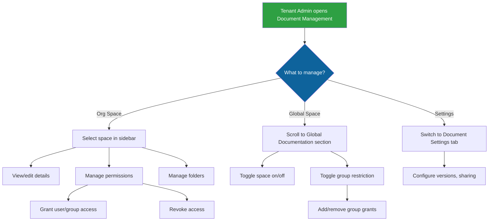

# Documents — Administration Guide

This guide covers document management for **tenant admins**. For end-user documentation on creating, editing, and browsing documents, see the Documents user guide.

---

## Tenant Admin: Document Management

Tenant admins manage organizational spaces, control which global spaces are visible to their users, and configure document settings.

**Navigate to:** Admin dropdown → **Document Management**

The Document Management page has two tabs: **Space Management** and **Document Settings**.

---

## Space Management

### Creating Organizational Spaces

Organizational spaces are shared containers for your team's documentation. They appear under **Organizational Spaces** in the Document Hub sidebar for users with access.

1. Click **+ Add** in the toolbar, then select **📂 New Space**
2. Enter a name, description, and visibility setting
3. Click **Create**

### Connecting a Confluence Space

You can connect an external Confluence space directly from the same menu.

1. Click **+ Add** in the toolbar, then select **🔗 Connect Confluence**
2. Follow the connect flow to select an integration, space, and sync mode

For the full connection walkthrough, see the **Confluence Integration — Administration Guide**.

### Editing Organizational Spaces

1. Select the space in the left sidebar
2. Modify the name, description, or visibility
3. Changes save automatically

### Deleting Organizational Spaces

1. Select the space you want to delete
2. Click **Delete Space**
3. Confirm the deletion

> **Note:** System-protected spaces cannot be deleted. The platform will show a message if you attempt to delete a protected space. When you delete a space, all documents in that space are also removed.

### Visibility Settings

Visibility controls the default access level for an organizational space:

| Visibility | Behavior |
|---|---|
| Workspace | Visible only to users who have been explicitly granted access |
| Private | Hidden from everyone except users with explicit permission |

### Managing Permissions

Permissions are assigned at the user or group level and control what users can do within a space.

| Permission Level | What It Allows |
|---|---|
| Read | View documents in the space |
| Write | Create, edit, and update documents |
| Admin | Full control — edit space settings, manage permissions, manage folders, delete documents |

**Granting access:**
1. Select an organizational space
2. Scroll to the **Permissions** section
3. Click **+ Grant Permission** to add a user or group
4. Select the target (user or group), choose a permission level (Read / Write / Admin)
5. Click **Grant**

**Revoking access:**
- Click the trash icon next to any permission entry

> **Tip:** Use groups to manage access at scale. Instead of assigning permissions to each user individually, create a group (e.g., "Engineering") in User Management, then grant that group access to relevant spaces.

### Managing Folders

Organizational spaces support **folders** to help users organize documents into a hierarchy. As an admin, you can create and manage the folder structure for any organizational space.

**Creating a folder:**
1. Select an organizational space
2. Click **+ New Folder**
3. Enter a folder name
4. Optionally select a **parent folder** to nest it under
5. Click **Create**

**Renaming or moving a folder:**
- Click the folder options menu and select **Rename** or **Move**
- When moving, select a new parent folder (or root) within the same space

**Deleting a folder:**
- Click the folder options menu and select **Delete**
- Documents inside the deleted folder are moved to the space root — they are not deleted

Folders can be nested to create a multi-level hierarchy. Users with admin permission on the space can also create and manage folders directly from the Document Hub.

### Controlling Global Space Visibility

Below the organizational spaces, the **Global Documentation** section lists all global spaces available from the platform.

**Enable/Disable a global space:**
- Use the **toggle switch** next to each global space to show or hide it for your organization
- When disabled, the space and all its documents are completely hidden from your users

**Restrict to specific groups:**
1. Enable the **Group Restricted** toggle on a global space
2. Click **+ Add Group** to grant access to specific groups
3. Only users in the granted groups will see the space
4. Users not in any granted group will not see the space at all

> **Default behavior:** All global spaces are **enabled** and **visible to everyone** in the organization. No overrides are needed unless you want to hide or restrict specific spaces.

---

## Document Settings

Switch to the **Document Settings** tab to configure document behavior for your organization.

### Maximum Versions per Document

Controls how many version snapshots of each document are retained. When a user creates a new version snapshot and the count exceeds this limit, the oldest non-protected version is automatically deleted.

- **Default:** 10 versions
- **Range:** 1–100
- **Protected versions:** Versions that are published or marked as "kept" (pinned) by users are never automatically deleted, even if the limit is exceeded.
- **Immediate enforcement:** When you lower this setting, existing documents are trimmed immediately — excess old non-protected versions are removed across all documents in the organization.

**To change:**
1. Go to the **Document Settings** tab
2. Adjust the **Max Versions per Document** value
3. Click **Save**

### Allow Public Sharing

Controls whether users can create **public share links** for their documents. A public link is a URL that anyone in the organization can use to access a document without needing an explicit share.

- **Default:** Enabled
- When **disabled**, the "Create Link" option is hidden from users in the Share modal, and existing public links stop working
- When **re-enabled**, previously created links resume working

Toggle this setting on or off from the **Document Settings** tab.

### Allow Internal Sharing

Controls whether users can **share documents with specific colleagues** (user-to-user sharing).

- **Default:** Enabled
- When **disabled**, the user share section is hidden from the Share modal
- When **re-enabled**, existing shares resume working

Toggle this setting on or off from the **Document Settings** tab.

> **Tip:** You can disable public sharing while keeping internal sharing enabled (or vice versa). This gives you fine-grained control over how documents circulate in your organization.

---

## Publishing Workflow Overview

Documents in your organization use a multi-space publishing model:

- All documents start as **drafts in the author's personal space**
- When ready, authors **publish** to one or more organizational spaces (and optionally into specific folders within those spaces)
- Publishing creates a snapshot — readers see the published version, not the live draft
- Authors can publish a **specific version snapshot** or always use the latest content
- Authors can **republish** to push updated content to all published spaces
- Authors can **unpublish** from individual spaces or all spaces at once
- Published versions are protected from automatic version cleanup
- Documents must be **archived** before they can be deleted

As an admin, you manage the organizational spaces (and their folder structures) that serve as publishing targets. Users need at least **Read** access to a space to see documents published there, and **Write** access to publish into it.

---

## AI Agent Integration

All global documentation is automatically available to the AI assistant. When a user chats with the assistant on a specific page, any global documents matching that page's routes are injected into the assistant's context.

Individual documents have an **AI Agent Access** toggle that authors can use to control whether a specific document is available to the AI assistant (enabled by default).

For **organizational and external (Confluence) spaces**, there is an additional **space-level** Agent Access toggle. Both the space-level and document-level toggles must be enabled for the AI to access documents in that space.

**Document Settings** also includes:

- **Allow Agent Sharing on Confluence Spaces** — Controls whether agents can access documents in personal Confluence spaces. Scoped to personal external spaces only.

> For full details on agent access for Confluence spaces, see the **Confluence Integration — Administration Guide**.

---

## Document Sharing

### How Sharing Works

Users can share individual documents with specific colleagues directly from the document editor. This enables collaboration without needing to move documents between spaces or publish them.

> **Note:** Both internal sharing and public link sharing can be independently enabled or disabled by the admin via the **Document Settings** tab. When a sharing method is disabled, the corresponding UI controls are hidden from users.

**Share types:**

| Type | Description |
|---|---|
| **User share** | Shared with a specific user by searching for their name or email |
| **Public link** | A URL-based share accessible by anyone in the organization with the link |

**Share permissions:**

| Permission | What the Recipient Can Do |
|---|---|
| Read (Can view) | View the document content only |
| Edit (Can edit) | View and edit the document content |
| Admin (Full access) | View, edit, and re-share the document |

### Public Link Features

Public links support several options beyond simple read-only access:

| Option | Description |
|---|---|
| **Permission** | Choose Read (view-only) or Edit (allows modifications) |
| **Password** | Optionally require a password before the document is shown |
| **Pin to version** | Lock the link to a specific version snapshot |
| **Expiration** | Set a date after which the link stops working |

Users can create up to **20 public links** per document, allowing different links with different settings for different audiences.

### Access Control Model

Document access is evaluated in layers. A user can access a document if **any** of these conditions are met:

1. **Admin override** — The user has the systemadmin or admin role
2. **Workspace visibility** — The document has `workspace` visibility (readable by all org members)
3. **Published status** — The document is published (readable by all org members)
4. **Ownership** — The user is the document author
5. **Share permission** — The user has an active (non-expired) share on the document
6. **Space permission** — The user has a permission grant on the document's space

For **write access**, the conditions are stricter — only ownership, admin role, edit/admin share, or write/admin space permission allows modification.

This layered model means that even documents in a user's personal space can be shared and accessed by specific colleagues — sharing transcends space boundaries.

### Collaborator Visibility

Documents with active shares display collaborator information:

- **Document Hub cards** show a 👥 badge with the collaborator count
- **Document editor** shows collaborator avatar circles (first initial, colored) in the toolbar

### "Shared with Me" View

Users who receive shared documents see a **Shared with Me** section in the Document Hub sidebar. This section:

- Appears between "My Space" and "Organizational Spaces" with a 🤝 icon and count badge
- Lists all documents that have been explicitly shared with the user
- Shows the share permission level, who shared it, and when
- Does not include documents accessible via space permissions or workspace visibility — only explicit shares

### Administrative Considerations

- **Share management:** The document author or any user with admin-level share permission can manage shares.
- **Self-share prevention:** The system prevents users from sharing a document with themselves.
- **Duplicate shares:** If a user is shared with multiple times on the same document, the highest permission level takes effect.
- **Expiring shares:** Shares can optionally include an expiration date. Expired shares are automatically excluded from access checks.
